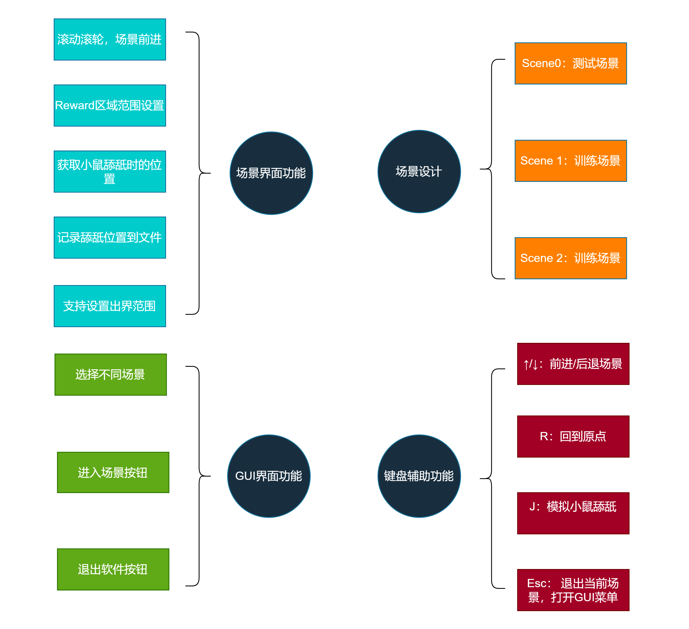
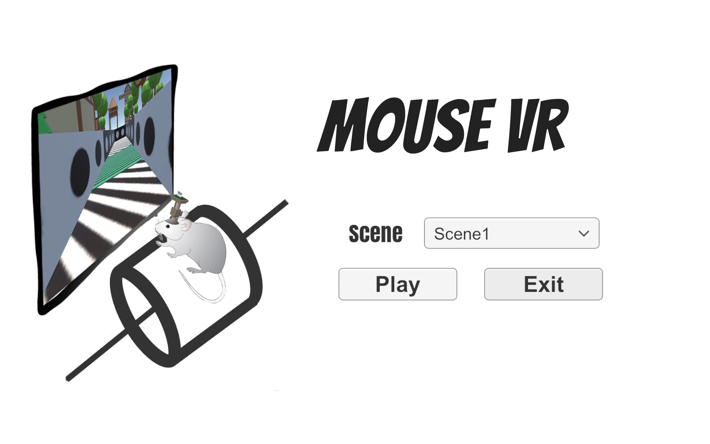
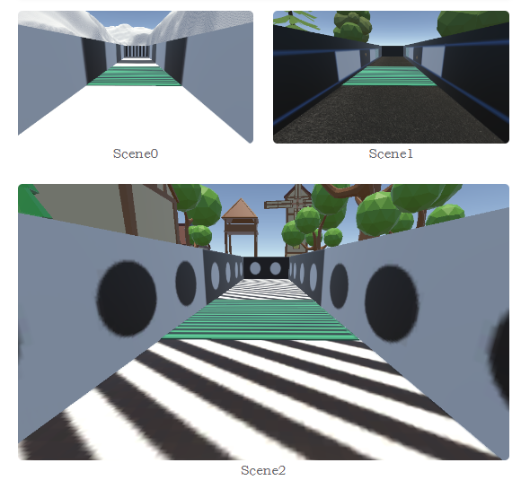

文档：https://www.yuque.com/achuan-2/cv09t6

## 实验设计方案

为了基于虚拟现实进行小鼠空间记忆行为范式的研究，虚拟现实场景主体设计为直线轨道，轨道某段设置为Reward区域，使用特殊条纹标记；空间记忆的任务训练设计为，当小鼠舔水嘴时，可以控制是否触发水嘴出水，当小鼠位于Reward区域舔水嘴时，触发水嘴出水进行奖赏，反之，当小鼠在非Reward区域舔水嘴时，会进行惩罚，水嘴不出水，并且会将虚拟场景移动到原点并锁住一段时间。此外，需要场景进行变化，而Reward区域保留，Reward区域可以移动位置。为了检测小鼠的空间记忆训练成果，设计是使用撤除奖赏和惩罚反馈，测定小鼠在奖励区域的停留情况。

## 软件功能和场景展示

本软件的整体功能设计如下：

​​

打开软件，首先会进入 GUI 界面，能够以下拉框的形式选择不同的场景，点击按钮即可进入场景，点击退出按钮则中断游戏。

​​

进入场景后，支持设置默认的场景原点，当小鼠滚动时，场景将前进。支持配置 Reward 区域的范围，当小鼠发生舔舐水嘴行为时，支持配置 n 次舔舐行为记为一次有效舔舐，Reward 区域和非 Reward 区域的舔舐行为计数相互独立，一旦小鼠跑到另一个区域舔舐，该区域的计数就会清空。对有效舔舐本将进行反馈，若在 Reward 区域产生有效舔舐，则会进行奖赏，奖赏形式为触发水嘴出水，反之，则进行惩罚，惩罚形式为回到原点并锁住 x 秒。每发生一次有效舔舐行为，软件会记录舔舐的信息到文件中，默认存放到软件所在路径下的“log/licking_log.csv”文件中，舔舐的信息包括舔舐时间、舔舐时的场景名、舔舐时的场景位置、是否在 Reward 区域舔舐。由于场景主体是直线轨道，考虑到小鼠可能会出界，支持设置场景出界范围，一旦小鼠出界，就会回到设置的场景原点。

目前已经设计了三个场景。Scene1 和 Scene2 是训练场景，除了 Reward 区域不同以外，其他场景内容会进行变化，Scene0 是测试场景，除去了对有效舔舐行为的反馈，旨在测试去除奖赏后，小鼠在 Reward 区域的停留。

​​

软件添加了键盘控制功能：按 ↑/↓ 能够前进/后退场景；按 R 键回到原点；按 J 键模拟小鼠舔舐行为；按下 Esc 键退出当前场景，打开 GUI 菜单。
